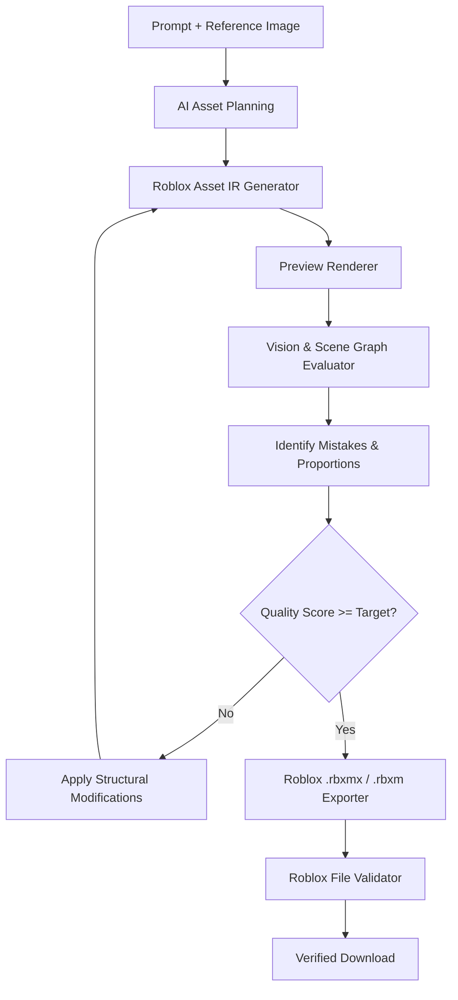

# Roblox Asset AI

<div align="center">

**A Specialized AI Studio for Roblox 3D Asset & Animation Synthesis**  
*Closed-Loop Visual Inspection • Iterative Self-Correction • Deterministic .rbxmx & .rbxm Exporters*

[](https://www.typescriptlang.org/)
[](https://nextjs.org/)
[](https://threejs.org/)
[](https://create.roblox.com/)
[]()

</div>

---

## 🎯 Purpose & Product Direction

**Roblox Asset AI is NOT a chatbot and NOT a general-purpose AI assistant.**

The AI has a single, hyper-specialized purpose:
1. **Generate Roblox 3D assets/models** (`Part`, `MeshPart`, `WedgePart`, `WeldConstraint`, `Motor6D`).
2. **Generate Roblox animations** (`KeyframeSequence`, `Keyframe`, `Pose` with timestamps and easing).
3. **Understand text descriptions** (proportions, materials, style).
4. **Understand reference images** (visual grounding and reconstruction).
5. **Visually inspect what it generated** (isometric render snapshot).
6. **Detect mistakes or differences** (missing parts, incorrect proportions, bad shapes, missing welds).
7. **Automatically improve the result through multiple iterations** (Self-Improvement Loop).
8. **Export the final result as a validated, downloadable Roblox-compatible file** (`.rbxmx` XML or `.rbxm` binary).

---

## 🔄 The Self-Improvement Loop

Unlike conventional text-to-3D systems that generate a model once and hope for the best, Roblox Asset AI implements a closed-loop visual critique architecture:



### Visual & Structural Dual Inspection
The Vision Evaluator inspects **both**:
- **A. Visual Information**: High-resolution 3D isometric snapshot of the current candidate model.
- **B. Structural Information**: The exact scene graph hierarchy (`Model` → `Part` sizes, CFrames, materials, and constraints).

---

## 📐 Roblox Intermediate Representation (IR)

The AI generates a deterministic JSON Intermediate Representation specifically designed for Roblox assets:

```json
{
  "assetType": "model",
  "name": "TreasureChest",
  "primaryPartId": "p_chest_base",
  "instances": [
    {
      "id": "p_chest_base",
      "name": "ChestBase",
      "className": "Part",
      "shape": "Block",
      "size": [4.0, 2.0, 2.8],
      "position": [0, 1.0, 0],
      "rotation": [0, 0, 0],
      "color": [105, 64, 40],
      "material": "WoodPlanks",
      "anchored": true,
      "canCollide": true
    },
    {
      "id": "p_gold_latch",
      "name": "GoldLatch",
      "className": "Part",
      "shape": "Block",
      "size": [0.6, 0.7, 0.25],
      "position": [0, 1.95, 1.45],
      "rotation": [0, 0, 0],
      "color": [239, 184, 56],
      "material": "Metal",
      "anchored": true,
      "canCollide": true
    }
  ]
}
```

---

## 💾 File Exporters & Strict Validation

### Supported Formats
1. **`.rbxmx` (Roblox XML Model)**: Standard XML representation compatible with Roblox Studio.
2. **`.rbxm` (Roblox Binary Model)**: Chunked binary format (`INST`, `PROP`, `PRNT`, `END\0`).
3. **`.json`**: Clean Intermediate Representation schema.

### Pre-Export Validation Suite
Every file is validated before download is permitted:
- Valid XML & chunked binary structure
- Verified Roblox class names (`Model`, `Part`, `WedgePart`, `WeldConstraint`, `Motor6D`, `KeyframeSequence`)
- Required property tags per class
- Unique referent keys (`RBX0`, `RBX1`, etc.)
- Non-degenerate CFrame transformation matrices
- Finite, positive Vector3 dimensions (Strict NaN / Infinity rejection)
- Acyclic parent-child hierarchy

---

## 🖥️ Modern Creative Studio Interface

- **Left Sidebar**: Large text prompt box, drag-and-drop reference image drop zone, mode toggle (`Model`, `Animation`, `Both`), style preset chips (`Stylized`, `Low-poly`, `Modular`, `Detailed`), self-improvement settings, and Generation button.
- **Center Canvas**: Interactive Three.js WebGL viewport with Roblox Studio lighting, studio grid, OrbitControls (rotate, pan, zoom, reset), wireframe mode, and animation playback timeline.
- **Right Sidebar**: Generation progress stepper, Quality Score gauge with sub-metric breakdown, **Iterations History tabs** (`Attempt 1`, `Attempt 2`, `Final`) allowing clicking previous attempts to compare in 3D, detected mistakes log, and download buttons.

---

## 🏆 RobloxAssetBench Automated Benchmark

Includes an automated benchmark measuring 11 metrics across 12 asset categories:
- **Categories**: Simple objects, Furniture, Buildings, Props, Vehicles, Environment pieces, Stylized assets, Low-poly assets, Reference image reconstruction, Model modification, Animation generation, Animation correction.
- **Metrics**: Prompt adherence, visual similarity, structural correctness, geometry correctness, proportion accuracy, material/color accuracy, animation accuracy, Roblox file validity, correction success, iterations count, generation time.

Run via CLI:
```bash
npm run benchmark
```

---

## ⚡ Kaggle Fine-Tuning Pipeline

Includes scripts and a Jupyter Notebook ready for free **NVIDIA T4 GPUs** on Kaggle:
- `scripts/generate_synthetic_dataset.py`: Generates synthetic `(prompt, referenceImage, targetAsset, render, critique, correction, finalScore)` JSONL pairs.
- `kaggle/train.py`: Standalone PyTorch + PEFT / LoRA fine-tuning script.
- `kaggle/train_roblox_asset_ai.ipynb`: Kaggle-ready notebook with GPU detection, checkpoint auto-save/resume, and evaluation report.

Generate synthetic dataset:
```bash
npm run generate-dataset
# or: py scripts/generate_synthetic_dataset.py
```

---

## 🚀 Python Runner & Quickstart Guide

You can run everything directly with **Python** (`main.py` or `run.py`).

### 1. Run the Studio Web Application
```bash
python main.py
# or:
python run.py
```
This automatically starts the server on port 3000 and opens your default browser!

### 2. Run Kaggle Dedicated Model Training / Inference
See the full step-by-step [Kaggle Setup Guide](KAGGLE_SETUP_GUIDE.md) for complete instructions on training and running on Kaggle.

```bash
# Fine-tune the 1.5B Roblox LLM on Kaggle T4 GPU
python main.py --train

# Run the Kaggle FastAPI inference server with an ngrok tunnel
python main.py --kaggle --ngrok <YOUR_NGROK_TOKEN>
```

### 3. Generate Directly via Command Line (CLI)
```bash
# Generate a model directly to an .rbxmx file without opening a browser
python main.py --generate "Stylized low-poly pirate treasure chest with gold lock" --format rbxmx

# Generate an animation directly
python main.py --generate "Character combat sword slash attack" --type animation
```

### 4. Run the Automated Benchmark
```bash
python main.py --benchmark
# or: npm run benchmark
```

### 5. Run Automated Tests
```bash
npm test
```
All 14 comprehensive tests pass: IR validation, Roblox XML export (`.rbxmx`), Roblox binary export (`.rbxm`), self-improvement loop, and RobloxAssetBench.

---

## 📖 Additional Documentation
- [Kaggle Complete Setup Guide (KAGGLE_SETUP_GUIDE.md)](KAGGLE_SETUP_GUIDE.md): Step-by-step guide on hardware selection (T4 GPU), running the turnkey Jupyter notebook, starting the FastAPI server, tunneling with ngrok, and connecting to the Web Studio.
- [Kaggle Directory & Scripts (kaggle/README.md)](kaggle/README.md): Details on `train.py`, `serve.py`, and `RobloxAssetAI_Kaggle.ipynb`.
